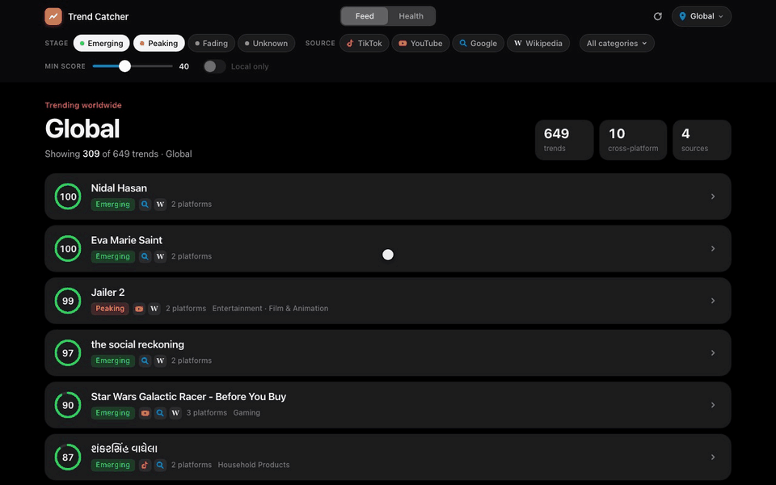

# Trend Catcher

[](https://github.com/AnoopIbrampur/trendcatcher/actions/workflows/tests.yml)
[](LICENSE)

Finds topics that are taking off across TikTok, YouTube, Google search and Wikipedia early enough
for a short-form creator (Reels / TikTok / Shorts) to still post about them, and turns
each one into a brief: what it is, whether it's brand-safe, and three video angles.



**[Read the case study →](docs/case-study.md)** How a backtest showed the first scorer was
answering the wrong question, and what fixed it.

```
sources (hourly)            score (per source)               merge                     brief
TikTok Creative Center ─┐   momentum, saturation,            embeddings for recall,    local LLM, grounded
Google Trends RSS ──────┼─> lifecycle stage, 0-100   ──>     token containment for ──> in collected evidence
Wikipedia pageviews ────┤   Wikipedia: learned p(stays hot)  precision                 (Ollama)
YouTube (API key) ───────┘
```

## Locations

Pick a country or a US state in the dashboard (or link straight to `?location=US-NY`), or
use `python -m trendcatcher top --location US-NY --local` in the terminal.

| Level | Google Trends | TikTok | YouTube | Wikipedia |
|---|---|---|---|---|
| Country (US, GB, CA, AU, IN) | ✓ | ✓ (not India: TikTok is banned there) | ✓ | ✓ per-country top list |
| US state (50 + DC) | ✓ | national fallback | national fallback | national fallback |
| City / metro | ✗ (Google's metro geos return nothing) | ✗ | ✗ | ✗ |

**Local** trends are what's specific to a place:
- **Country:** not trending in any other tracked country.
- **US state:** not in the US national list, and trending in no more than 3 other states.

The first version only checked against the national list, and nearly every state item came
out "local", because Google's national list holds just ~10 items. Local trends are listed first.

## Results so far

The useful question for a creator isn't "is this big?" but **"will there still be an
audience if I post tomorrow?"** I tested that on 59 days of Wikipedia history
(walk-forward, model refit each day only on labels it could have seen):

> label: mean views over the next 3 days stay ≥ 2× the article's 7-day baseline

| method (top 20 per day, 41 days) | stays hot | beats "most viewed" |
|---|---|---|
| **Trend Catcher (logistic model)** | **75.6%** | 40 / 41 days |
| breakout ratio alone | 71.0% | 37 / 41 |
| hand-tuned heuristic | 61.6% | 26 / 41 |
| "most viewed" list | 54.4% | — |
| random breakout candidate | 24.7% | — |

The same picks **lose to random** if you ask "will views keep rising?" (18% vs 24%).
Wikipedia spikes peak the day they appear and then decay. So momentum tells you a topic is
hot; it does not tell you the topic is still early. Most of the signal is the breakout ratio
itself, and the model adds about 5 points on top of it. The first label I tried
(keep-rising) was the wrong question, and the backtest is what showed that.

**Per country** (each country's own Wikipedia most-viewed list, same method):

| Region | Days tested | Trend Catcher | Breakout ratio alone | Most viewed | Random |
|---|---|---|---|---|---|
| Worldwide (English) | 41 | **75.6%** | 71.0% | 54.4% | 24.7% |
| United States | 42 | **71.8%** | 63.8% | 56.1% | 22.7% |
| United Kingdom | 43 | **70.3%** | 65.2% | 56.0% | 20.0% |
| India | 36 | **83.1%** | 79.6% | 40.6% | 34.7% |
| Canada | 22 | **54.5%** | 51.1% | 44.5% | 24.2% |
| Australia | 8 | **45.6%** | 37.5% | 40.0% | 23.6% |

The model wins in every region, and its lead over the plain breakout ratio is larger for
countries (+4 to +8 points) than for the worldwide list. Canada and Australia have short
lists, so the model only has enough training rows on a few days: treat those rows as
indicative, not proven.

Reproduce: `python -m trendcatcher backtest --region US` (or `en`, `GB`, `IN`, `CA`, `AU`)

## Data sources: what actually works (Oct 2026)

| Source | Access | Notes |
|---|---|---|
| TikTok Creative Center | public JSON endpoint, no login | Anonymous requests return only the top 3 hashtags per query. Sweeping 15 industry filters × 4 countries gets about 150 hashtags with 7-day popularity curves, views and post counts. |
| Google Trends | public RSS | ~10 items per country; mostly live sports and news |
| Wikipedia | Wikimedia REST API | daily top-1000; backfillable, which is what gives the backtest its labels |
| YouTube | Data API v3 key (free, no approval) | `YOUTUBE_API_KEY` in `.env`; top 50 trending, scored by views per hour since upload |
| Reddit | **approval required** | Unauthenticated `.json` endpoints return 403, and under Reddit's [Responsible Builder Policy](https://support.reddithelp.com/hc/en-us/articles/42728983564564-Responsible-Builder-Policy) API access needs explicit approval via a support ticket. The adapter is written but untested; it skips cleanly without keys. |
| Instagram | none usable | the Graph API only covers accounts you manage. IG is where creators post, not a data source; the idea is to spot trends on TikTok before they reach Reels. |

## Run it

```bash
python3 -m venv .venv && .venv/bin/pip install -e ".[dev]"
.venv/bin/python -m trendcatcher sync              # pull cloud-collected data, rate new trends
.venv/bin/python -m trendcatcher ingest            # or collect locally (only while the machine is awake)
.venv/bin/python -m trendcatcher backfill-wiki --days 60
.venv/bin/python -m trendcatcher top               # mixed feed in the terminal
.venv/bin/python -m trendcatcher serve             # web app on http://localhost:8517
.venv/bin/streamlit run trendcatcher/dashboard.py  # older Streamlit dashboard (same features)
.venv/bin/python -m trendcatcher status            # collection health
scripts/schedule.sh install                        # hourly launchd sync job (uninstall to remove)
.venv/bin/python -m pytest
```

Video briefs and cross-platform merging need [Ollama](https://ollama.com) with
`nomic-embed-text` and `qwen3.5:9b`. Without it, merging falls back to exact lexical
matches and the brief button is disabled.

## The app

`python -m trendcatcher serve` starts a FastAPI server (`trendcatcher/web/server.py`) and a
hand-built single-page front end (`trendcatcher/web/static/index.html`, no build step and no
framework). The design follows Apple's interface guidelines:
- **Filters run in the browser.** They respond on press, with no server round trip.
- **Animations are interruptible springs.** Card expansion, popovers and the tab indicator
  start from their current on-screen value, so tapping a card again mid-animation reverses it smoothly.
- **The chrome is translucent.** The header and popovers blur the content scrolling underneath them.
- **Typography:** tracking changes with font size.
- **Modes:** light and dark, plus `prefers-reduced-motion`, `-transparency` and `-contrast` support.

Every location has a shareable link (`/?location=US-NY`, `/?tab=health`).

## Cloud collection

A laptop that sleeps misses most hourly runs (in the first 21 hours, Google Trends ran 6
times out of ~21). So collection runs in GitHub Actions (`.github/workflows/collect.yml`):
- **The job:** every hour it runs whatever sources are due (Google hourly, YouTube every 3h,
  TikTok every 6h, Wikipedia four times a day) and commits new files to the
  [`data` branch](../../tree/data).
- **The files:** one immutable gzipped JSONL file per capture, about 2.6 MB a day in total.
- **Your machine:** `python -m trendcatcher sync` fetches only the latest state of that branch
  and imports files it hasn't seen.
- **API keys:** YouTube needs a `YOUTUBE_API_KEY` repository secret. Without it, that source is skipped.

## Design notes

- **Scores are percentiles within each source**, so a TikTok score and a Wikipedia score
  mean "how strong is this relative to everything else on that platform right now". The feed
  interleaves sources instead of sorting globally, so one platform can't flood it.
- **Saturation (TikTok):** views per post. Lots of views on few posts means audience demand
  is outrunning creator supply, which is the opening a creator wants.
- **Merging across platforms:** short strings fool embeddings ("jane doe" vs "John Doe" has
  cosine 0.90). A merge needs cosine ≥ 0.86 **and** one item's tokens contained in the
  other's. That joins `#digger` and *Digger (2026 film)* but keeps the Quebec and Spanish
  elections apart. Long video titles get a narrower second rule: a multi-word name inside the
  title ("Jailer 2" inside *JAILER 2 - Official Trailer | …*). That rule is restricted to
  video and post titles, because applying it to Wikipedia attached the TikTok hashtag
  `#cornelluniversity` to an article about allegations at Cornell.
- **LLM briefs are grounded:** the prompt carries the collected evidence (metrics, news
  headlines, Wikipedia summary) and the model must answer "unclear" rather than invent what
  a hashtag means. It does this: `#digger` is tagged *Vehicle & Transportation* by TikTok,
  so it's probably excavator videos rather than the film, and the model flags the conflict
  instead of choosing one.
- **Merge precision, measured:** all 89 merged pairs across 9 feeds were hand-labeled
  ([docs/merge-audit.csv](docs/merge-audit.csv), one annotator). The audit found a real bug:
  the English-only embedding model scores unrelated text in Indian scripts as near-identical
  (0.98+), which merged 9 unrelated Gujarati, Telugu, Kannada and Marathi searches. With a
  shared-word requirement and script-aware tokens, precision is **97.5%** "same or related
  trend" (73.8% strictly the same story; the rest are the same franchise or event, such as
  the 2026 and 2022 Quebec elections). The remaining errors are a generic Google search
  ("kitchen") joining TikTok kitchen hashtags.
- **Creator fit in the ranking:** attention isn't filmability; the hottest search of the hour
  is often a live hockey score. The local model rates each trend 0–10 for creator fit plus
  brand safety, ten per prompt and cached by label, and the rank score becomes
  `attention × (0.5 + 0.05 × fit)`, with another 30% off for "avoid". The 9B model is used
  because, on 20 real trends, the 2B model rated a mass shooter and minor news figures as
  moderately filmable. Cards show the fit and explain the blend.
- **Grounding bare hashtags:** a TikTok hashtag with no news or Wikipedia match gets a
  name-matched Wikipedia article as a labeled hint (every word must appear in the title, and
  one-word tags must match exactly). That fixed two wrong briefs: `#balloonfiesta` was read as
  party decorations (it's the Albuquerque hot-air balloon festival), and `#jimothy` was
  "unclear" (it's a viral Seattle raccoon).
- **Bots:** Wikipedia articles with >90% desktop traffic are dropped (scrapers), as are
  calendar, year and "Deaths in" pages.

## Limitations / next

- TikTok scoring is still a heuristic. It needs a few weeks of hourly snapshots before
  post-count growth can be used as a feature, and before the same backtest can be run on it.
- The cross-platform "who saw it first" lag (TikTok → Reels) is the original thesis and
  isn't measurable yet. `first_seen` is recorded per source so it can be measured later.
- Creator-fit ratings come from a local model's judgment and haven't been validated against
  real creator outcomes.
- The data branch grows about 80 MB a month and will need pruning eventually. GitHub may also
  pause scheduled workflows in a repo with no recent activity.
- Hashtag ambiguity: TikTok's industry tag should be used as a merge constraint.

## License

MIT, see [LICENSE](LICENSE).
