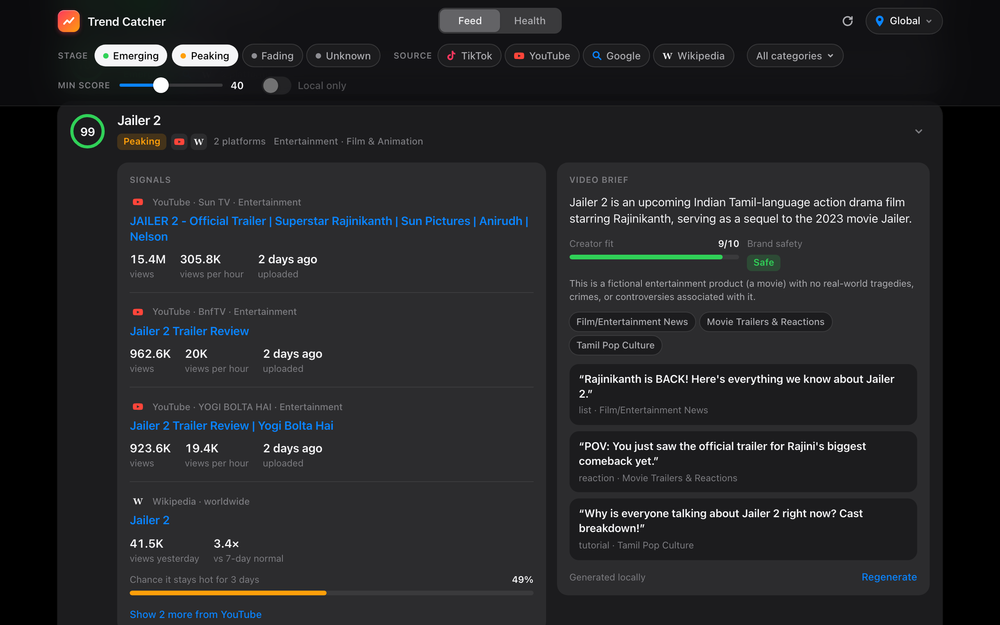
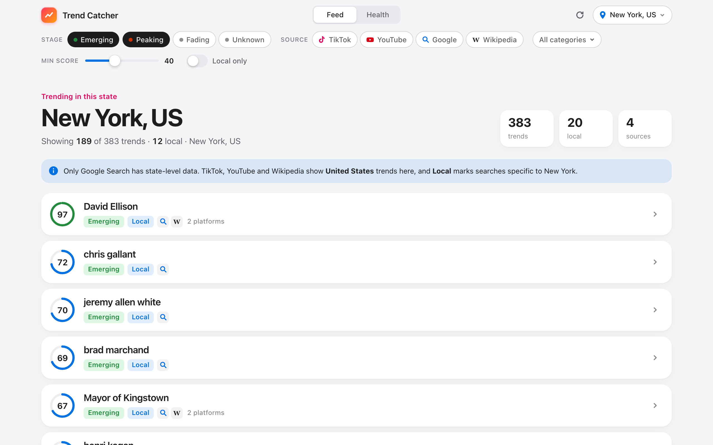

# Case study: finding trends while there's still time to post

Trend Catcher tells short-form creators which topics are worth a video **right now**. This is
the story of how it got there. The most useful moment was a backtest showing that the
obvious approach answered the wrong question.

## The problem

"Trending" lists show what is already big. A creator needs something different: a topic
with enough audience left that a video posted tomorrow still finds viewers. So the target is
not popularity. It is **remaining attention**.

## Constraint 1: the data you can actually get

The first step was finding out what is reachable without a business account:

| Source | Reality |
|---|---|
| Instagram | No usable API. The Graph API only covers accounts you manage. |
| TikTok | Creative Center has a public endpoint, but anonymous calls return only 3 hashtags. Sweeping its 15 industry filters across 4 countries gets about 150 hashtags per run, each with a 7-day popularity curve. |
| Reddit | Unauthenticated access returns 403, and API access now needs approval under Reddit's Responsible Builder Policy. |
| Google Trends | Public RSS. It works down to US states but not cities (metro codes return nothing). |
| YouTube | Free API key, top 50 trending per country. |
| Wikipedia | Daily top-1000 lists, worldwide and per country, and they can be **backfilled**. |

That last point shaped the project. Wikipedia was the only source with months of history
available on day one, so it was the only place the scoring could be tested properly from
the start.

## Wrong question first

The first scorer did the intuitive thing: rank articles by **breakout ratio** (today's views
against their 7-day normal) and boost those still climbing. The label for the backtest was
"will views keep rising over the next 3 days?"

The walk-forward backtest said no. Breakout picks kept rising **18%** of the time, against
**24%** for random candidates. Splitting the data by each feature showed why: on Wikipedia,
*every* momentum signal predicts decline. A news spike peaks the day it appears and then
decays. The articles most likely to "keep rising" were evergreen pages wobbling around their
average, which are not trends at all.

That isn't a modeling bug. It's the wrong question. A creator doesn't need views to keep
climbing; they need the audience to **still be there**.

## The right question

New label: **does the topic stay at ≥2× its normal views for the next 3 days?**

With that label the features point the right way. Among breakout candidates (≥1.5× normal),
the top fifth by breakout ratio stays hot **54%** of the time, against **24%** for candidates
overall and 8% for all top-list articles. Multi-day stories also outlast one-day spikes.

The model is deliberately small: a logistic regression on five features (breakout ratio,
1-day and 2-day change, log views, days in the top list). It is trained walk-forward: each
day it is refit only on labels that were fully observed by that day. A unit test checks that
a day's features are identical whether or not the future exists in the data, so no
information can leak back from the label period.

## Results

Of each day's top 20 picks, the share that stayed hot:

| Region | Days | Trend Catcher | Breakout ratio alone | Most-viewed list | Random |
|---|---|---|---|---|---|
| Worldwide | 41 | **75.6%** | 71.0% | 54.4% | 24.7% |
| United States | 42 | **71.8%** | 63.8% | 56.1% | 22.7% |
| United Kingdom | 43 | **70.3%** | 65.2% | 56.0% | 20.0% |
| India | 36 | **83.1%** | 79.6% | 40.6% | 34.7% |

The honest reading:
- **Most of the signal is the breakout ratio.** The model adds 4–8 points on top of it.
- **The hand-tuned heuristic tried first was worse than the plain ratio** (61.6% worldwide).
  Without the backtest it would have shipped.
- **India shows the gap most clearly.** Its most-viewed list barely beats random (41% against
  35%), because the top of the list is dominated by evergreen pages.
- **Canada and Australia** have short lists and only 8–22 testable days, so their results
  are indicative, not proven.

## Merging the same trend across platforms

A trend shows up as `#digger` on TikTok, *Digger (2026 film)* on Wikipedia and a trailer on
YouTube. Merging them needed both meaning and spelling:

- **Embeddings alone over-merge short strings.** "jane doe" and "John Doe" score 0.90 cosine
  similarity, and so do "wuthering waves" and "Wuthering Heights". A merge therefore needs
  cosine ≥ 0.86 *and* one item's words contained in the other's. That keeps the 2026 Quebec
  and Spanish elections apart.
- **Long video titles needed a second rule:** a multi-word name inside the title ("Jailer 2"
  in *JAILER 2 - Official Trailer | …*). In its first version this rule attached the TikTok
  hashtag `#cornelluniversity` to a Wikipedia article about rape allegations at Cornell.
  For a tool that rates brand safety, that is the worst possible error, so the rule is now
  limited to video and post titles, with a regression test.

## Local trends

"Local" seemed simple: trending in New York but not in the US national list. In practice
nearly everything qualified, because Google's national list only holds about 10 items, and
"ncis" counted as local to New York *and* Texas. The working definition: not national,
**and** trending in no more than 3 other states. That leaves Buffalo Sabres scores in New
York and "fires near me" in California.

## Video briefs from a local model

Each trend can be turned into a brief: what it is, creator fit, brand safety and three
hooks. A local Qwen model runs through Ollama. A model's knowledge is always older than
today's trends, so the prompt carries only collected evidence (metrics, news headlines,
Wikipedia summaries), and the model must answer "unclear" rather than guess.

That mostly holds. TikTok files `#digger` under *Vehicle & Transportation*, which suggests
excavator videos rather than the Tom Cruise film, and the model flagged the conflict instead
of picking one. But with nothing to go on, it misread `#balloonfiesta` as party
decorations: the hashtag is the hot-air balloon festival. TikTok-only hashtags need more
grounding.

## What's next

- **Backtest TikTok.** Its scoring is still a heuristic. It needs a few weeks of collected
  snapshots before it can be labeled and tested like Wikipedia.
- **Measure the cross-platform lag.** The original idea is that trends hit TikTok before
  Reels and YouTube. The app now records when each source first sees a trend, so the lag
  becomes measurable once history builds up.

## Lessons

1. **Check that the label is the question the user is actually asking.** The first model was
   fine; the first label was wrong.
2. **Compare against the dumbest baseline that could work.** The plain breakout ratio did
   most of the work, and it beat the hand-tuned scoring.
3. **In a recommender that rates brand safety, a false merge is a bigger problem than a
   missed one.**
